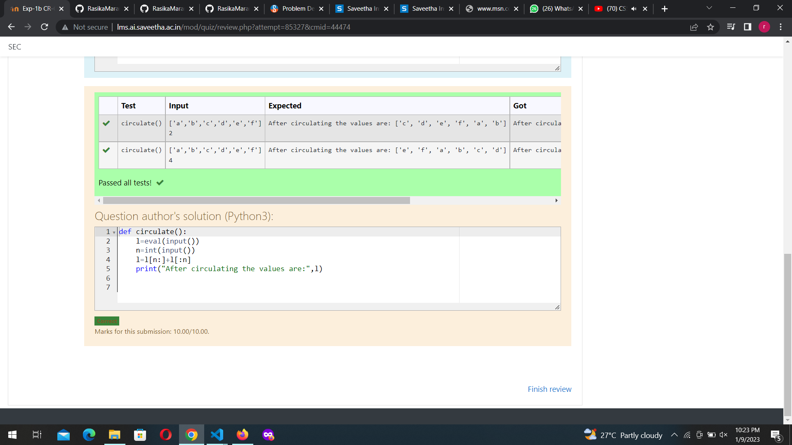

# Circulate-the-values-of-N-variables
## Aim:
To write a python program to circulate the n variables using function concept
## Equipment’s required:
PC
Anaconda - Python 3.7
## Algorithm: 
### Step 1: 
Get the list of values from the user

### Step 2: 
Get the values from the user for the number of rotation

### Step 3: 
Declare a function starting with a keyword "def"

### Step 4: 
Using the function print the output statement

### Step 5: 
Using the slicing concept rotate the statement

### Step 6: 
Display the output

## Program:
```python
#Program to circulate N values.
#Developed by: 
#RegisterNumber:
def circulate():
    l=eval(input())
    n=int(input())
    l=l[n:]+l[:n]
    print("After circulating the values are:",l)
## Output:

## Result:
The circular the values of N variables is successful